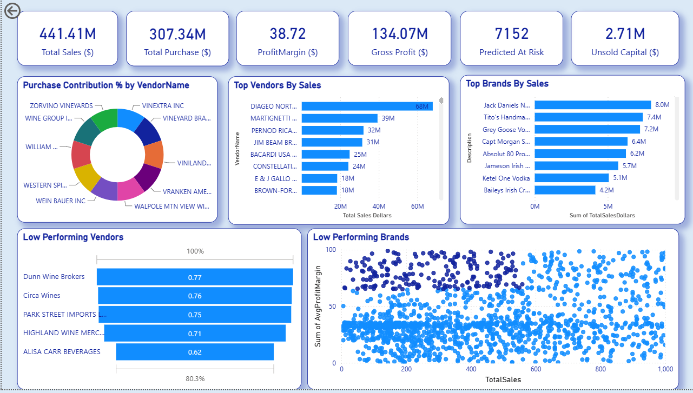
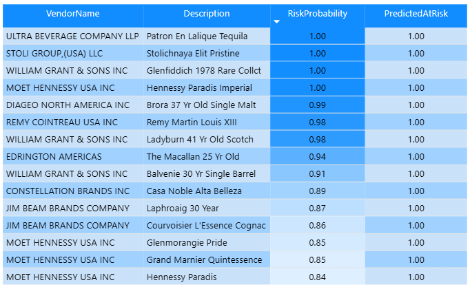

# Vendor Performance Analysis

An end-to-end analysis of vendor and brand performance for a retail/distribution 
dataset, built with SQL, Python, and Power BI. Goes beyond dashboarding — 
includes percentile-based outlier detection, a two-sample hypothesis test on 
vendor profit margins, and a trained ML model to flag at-risk vendors.

## Tools Used
- **SQL** (SQLite) — data storage and aggregation via CTEs
- **Python** — pandas, SQLAlchemy for ingestion; matplotlib/seaborn for EDA; 
  scipy for statistical testing; scikit-learn for the risk classifier
- **Power BI** — interactive dashboard

## Data
Six source tables: `purchases`, `purchase_prices`, `sales`, `vendor_invoice`, 
`begin_inventory`, `end_inventory` — ingested from CSV into a SQLite database 
(`inventory.db`), then merged into a single `vendor_sales_summary` table 
(10,692 rows, 128 vendors) via a multi-CTE SQL query joining purchase, sales, 
and freight data at the vendor-brand level.

## Workflow
1. **Ingestion** (`ingestion_db.py`) — loads all CSVs in `data/` into SQLite
2. **Summary build** (`get_vendor_summary.py`) — SQL CTEs join purchases, 
   sales, and freight per vendor/brand
3. **Cleaning & feature engineering** — derives KPIs below, handles nulls, 
   strips whitespace
4. **Exploratory analysis & hypothesis testing** (Jupyter notebook)
5. **Anomaly detection** (`anomaly_detection.py`) — z-score based flagging 
   of unusual profit margin / stock turnover
6. **Risk classification** (`vendor_risk_classifier.py`) — logistic 
   regression predicting at-risk vendor-brands
7. **Dashboard** — Power BI report built on the cleaned summary + model outputs

## KPIs
| KPI | Definition |
|---|---|
| Total Sales | Sum of `TotalSalesDollars` |
| Total Purchase | Sum of `TotalPurchaseDollars` |
| Gross Profit | Total Sales − Total Purchase |
| Profit Margin (%) | Gross Profit / Total Sales × 100 |
| Unsold Capital | (Purchase Qty − Sales Qty) × Purchase Price, summed per vendor |
| Stock Turnover *(supporting metric)* | Sales Qty / Purchase Qty |

## Dashboard

**Page 1 — Vendor Performance Overview**

- Total Sales: **$441.41M** | Total Purchase: **$307.34M** | Gross Profit: 
  **$134.07M** | Unsold Capital: **$2.71M**
- Top vendor by sales: Diageo North America (~$68M); top brand: Jack Daniel's 
  No. 7 (~$8.0M)

**Page 2 — Vendors At Risk (ML-flagged)**

A logistic regression model, trained on purchase-side features only 
(PurchasePrice, FreightCost, Volume, purchase quantity/dollars — no 
sales/margin fields, to avoid leakage), flags vendor-brands likely to become 
low-performing. This table shows the highest-confidence predictions, sorted 
by risk probability.

## Key Insights
- **Vendor concentration (Pareto analysis):** a small set of top vendors 
  accounts for the large majority of total purchase spend — visualized with 
  a cumulative contribution chart and donut breakdown.
- **Low-turnover vendors flagged:** vendors with Stock Turnover < 1 (selling 
  slower than they're restocking) were identified as carrying excess/slow-moving 
  inventory — the biggest driver of the $2.71M unsold capital figure.
- **Bulk purchasing lowers unit price:** vendors buying in larger order sizes 
  get a measurably lower average unit purchase price.
- **High-margin, low-sales brands identified:** brands in the bottom 15th 
  percentile of sales but top 85th percentile of profit margin were flagged as 
  candidates for pricing/promotional review.
- **Statistical test — top vs. low-performing vendors:** split vendors into 
  top and bottom quartile by sales, computed 95% confidence intervals for 
  profit margin, then ran a Welch's two-sample t-test. **Result: p < 0.05** — 
  low-sales vendors have a significantly *higher* average profit margin than 
  high-sales vendors.
- **ML risk model — premium/rare items flagged as highest risk:** the 
  classifier (ROC-AUC 0.68) independently learned that high purchase price + 
  low order quantity predicts risk, surfacing items like Patron En Lalique 
  Tequila and Hennessy Paradis — an explainable, non-obvious finding.

## Limitations
- Profit Margin is undefined (excluded from stats) for ~178 brands with zero 
  recorded sales — these are tracked separately as a "zero-sales" flag rather 
  than treated as statistical outliers.
- The dataset covers a single time snapshot with no reliable date range for 
  time-series forecasting; the risk classifier is cross-sectional, not 
  time-based.
- The risk classifier has high recall but modest precision (~0.33) — it's 
  best used as a screening/triage tool, not an automated decision-maker.

## Repo Structure